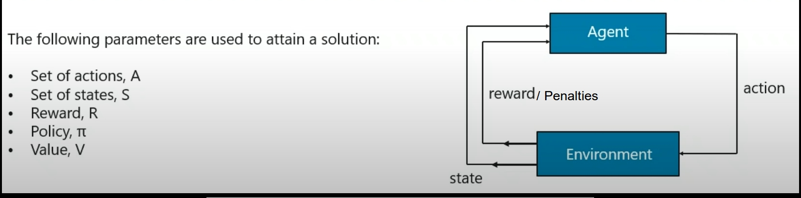

### [\*] Un-Supervised Learning Algos
  * In this, the model/agent is put in an un-known environment and it learns based on the actions done and the rewards/penalties received.
  * The model learns by hit & try.
  * Agent = Model, Environment = setting in which the model/agent is placed.
  * Working:
    1. Environment sends state to agent.
    2. The agent based on it's observation takes an action in response to that state.
    3. The environment now sends the new state along with the reward/penalty for last action.
    4. The agent will update it's knowledge of the last action with the reward/penalty received from the environment and evalutate it last actions.
    5. This is repeated untill the environment sends terminate state to the agent.
  * Eg: Used in games - alphaGo, Dota etc
  * Terminology:
    * Policy: The approach taken by the agent to determine the next action based on the current state.
    * Value: The expected long-term return with discount, as opposed to the short-term reward R.
    * Action-Value: Similar to value, except it takes CurrentAction as additional parameter.
  * Aim:
    * The whole purpose of the agent is maximise the reward,
  * Markov Decision Process:
    * It is the mapping of a solution in reinforcement learning.

 </img>

  * Goal is to define the best policy in order to maximise the rewards.

**1. Q-Learning**:
  * It is an off policy algo that tries to find the best action to take given the current state. 
  * It’s considered off-policy because the q-learning function learns from actions that are outside the current policy, like taking random actions, and therefore a policy isn’t needed. 
  * The agent seeks to learn a policy that maximizes the total reward.
  * Terminology:
    * Exploitation : Going to the known areas where success is highly probable, i,e doing those actions in which  therer are higher chances of max rewards.
    * Exploration : In this the actions are taken randomly so as to go to an un-known state, which helps the agent disccover new states that otherwise might not have been visited.
    * Gamma: Parameter used to define Exlporation/Exploitaion.
      - Closer to 0 means exploitaition, closer to 1 means exploration.
  * Algo:
    1. Set gamma parameter and environment reward matrix R
    2. Intialise matrix Q(memory of agent) to 0.
    3. Select random state. 
    4. Set current state as initial state.
    5. Select one among all possible actions for current state.
    6. Using possibhle action consider going to next state
    7. Get max Q value for current state based on all possibnle actions
    8. Q(state, action) = R(state, action) + Gamma * Max[Q(next\_state, all\_actions)]
    9. Rpeat untiil current state != goal state.
