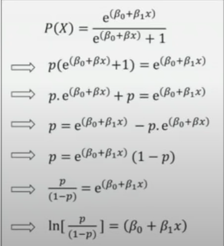

### [\*] Supervised Learning Algos

**1. Linear Regression:**
  * It is used to predict a **dependent continous** variable **Y** depending upon an independent variable **X** which can be continous or discrete.
  * Eg: stock price predict
    * O/P i.e dependent variable = stock price
    * I/P i.e in-dependent variable = time
  
  * The can be used if the relation b/w both the variables is linear(not necessarily but will make algo complex * non-linear), so firstly draw the relation using best fitting linear line.
```bash
    y = y0 + m*x + c
y = output
y0 = y-intercept
m = slope
x = x-intercept
c = Constant/Error
```
  * Running the Linear regresion model will generate the values for y-intercept, slope and x-intercept which best fits the data (this is the model)
  * The model depends heavily on the input data.


**2. Logistic Regression:**
  * It is more like a classifier than actual regression.
  * This model tells the **probability** of a certain class or event existing, such as pass/fail, win/loose, dead/alive etc . It uses a set of independent variables and outputs a categorical answer.
  * The output curve would be sigmoid since the output lies b/w 0 to 1.

 FORMULA:
  

  * Now since resultant is a *positive* value b/w *0 and 1* thus: 
    * take exponen of eqn, since it will always be positive
    * x/(x+1) qill always be less than 1


**3. Decision Tree:**
  * It is also a classification algo.
  * In this a Tree is formed , wherein each node of tree represents a **predictor variable(feature)** , the link b/w the nodes represents the decision and each leaf node represents the **outcome**
  * Structure:
    * Root Node: It is the starting point of tree and contains the feature which can splits/segregate the data in the best way possible.
    * Internal Node: Child of root, the farther it is from root, the more specific feature are targetted
    * leaf/terminal-nodes : Final output
    * Branches: Link b/w nodes
  * Information gain & entropy are used to decide the which node to select at which level (feature with higher value will be preferred)
  * Dis-adv:
    * Over-fitting: This happens when model learns even the error/disturbances of the training data.

**4. Random Forest:**
  * This builds multiple decision trees and combine the together to get a mnore accurate and stable prediction.
  * Introduces **bagging** for handling over-fitting of decision tree.
  * It basically tests for all the decision trees in the forest and the based on the number of votes classifies the test-case.

**5. Naive Bayes:**
  * It is based on Bayes theorem.
  * It is also a classification algo.
  * It is called *Naive* because it assumes that there is no co-relation b/w the predictor(input) variables & they are totally independent of each other. (which is not always True in real-life)

```bash
Bayes Theorem
P(A|B) =  (P(A) * P(B|A)) / P(B) 

P(A|B): Probability of A, given B is true
P(B|A): Probability of B, given A is true
P(A), P(B): Independent probabilties of A and B
```


**6. K-Nearest Neighbour(KNN) :**
  * It is also a classification algo, which classifies a new data point depending on the features of it's neighbouring class.
  * It is non-parametric i.e it doesn't assume anything regarding the relation b/w the features.
  * It is lazy i.e it memorises the training set instead of trying to find the model (form model)
  * Based on feature similarity with neighbouring data points
  * **k** in KNN stands for number of neighbours.
    * Depending upon the value of **K** the output could vary & so it the model efficiency.
  * **Elbow Method**: It is used to find the optimum K value for particular dataset. 
    * Compute SSE (sum of squared error) i.e sum of squared distance b/w each point of the cluster and it's centroid.
    * As K increases SSE decreases, pick the value of K at which the SSe saturates.


**7. Support Vector Machines:**
  * It is also used to classify dayta into diff classes.
  * It uses hyper-plane which is a decision boundary b/w the classes. 
  * It can generate multiple hyper-planes such that each point lies in a single plane
  * Support Vectors: The points closest to the hyper-plane are called support vectors. 
  * The best hyper-plane will have the maximum distance from the support vectors, this distance is called Margin.
  * Steps:
    1. Draw random hyper-plane.
    2. Compute margin distance.
    3. Fine tune hyper-plane to increase margin.
    4. Repeat step3 untill the margin no longer increases.
  * Non-linear SVM is used when the data can't be seperated using straight line.
    * In this, kernels are used.
    * Kernel: It is something that can be used to transform the data into another dimension that has a clear dividing margin b/w the classes of data. It basically helps user transform the data from non-linear spaces to linear.
