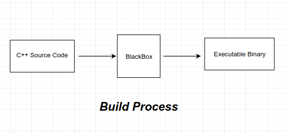

### C++ Build Process

* C++ (based on C) is a mid-level compiled language.
* Compiled language : It means the source code goes through a couple of steps to finally create the binary executable.

</img>

#### [\*] Steps

---
> **Note :** The below mentioned steps and examples are specifically for GNU gcc, though most other compilers follow the same process.
---
* In the above image, their is a `BlackBox`, these steps will goes through explaining the internals of it :


**1. Pre-processing** : In the first phase , all the `#includes` , `macros`  , `conditional compilation`  basically all the statements that begin with `#` are processed i.e the pre-processor replaces that particular line with the actual content of the line.

```bash
$ cat example.cpp
#include<iostream>

#define a 5

int main()
{
  std::cout<<"Macro a is : " << a<<std::endl;
}

$ cpp example.cpp > example.i
# 'cpp' is the name of the pre-processsor , it line by line replaces the '#' with their actual definitions.

# example.i file contains the pre-processed code and contains the expanded source code.
```

  **2. Compiling** : In the compilation phase, the compiler compiles the pre-processed source code into assembly code for a specific processor.

```bash
$ g++ -S example.i -o example.s
# The compiler creates the assembly code, for the processor of the machine the compiler is running on.
```

  **3. Assembly** : In this phase, The assembler converts the assembly code(`example.s`) into machine code in the object file `example.o`.

```bash
$ as -o example.o example.s
# Thus the compiled and assembled 'object' file is ready now.

```

  **4. Linking** : In the final linking phase, the linker links the diff object files together with the library code to produce an executable file "example".

```bash
$ ld  -o example example.o `other required libraries here`

# The final executable is produced here.
```

#### [\*] C++ add-ons

* The build process and steps that we discussed above are same for C, rather they are of `C` only and `C++` was designed to be compatible with them.
 
* Primary thing
  1. templates
  2. Name mangling
  3. Function over-loading, covered in mangling


**Ques:** Do you remember that there was no concept of function overloading in C, then how did C++ have it (since it is based on C only)?
**Ans :** Name Mangling i.e it simply replaces the name internally.


#### [\*] References/Resources

* <a href="https://github.com/gchatelet/gcc_cpp_mangling_documentation">Name Manglings</a>
* <a href="https://github.com/green7ea/cpp-compilation">CPP Compilation</a>
* <a href="https://www.airs.com/blog/archives/38">What are Linkers</a>
* <a href="https://stackoverflow.com/questions/6264249/how-does-the-compilation-linking-process-work">Compilation & Linking</a>
* <a href="https://stackoverflow.com/questions/3322911/what-do-linkers-do/33690144#33690144"> Linkers: Relocation</a>
* <a href="https://www.iecc.com/linker/"> Linkers and Loaders</a>
