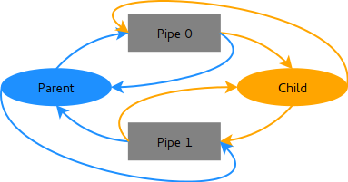
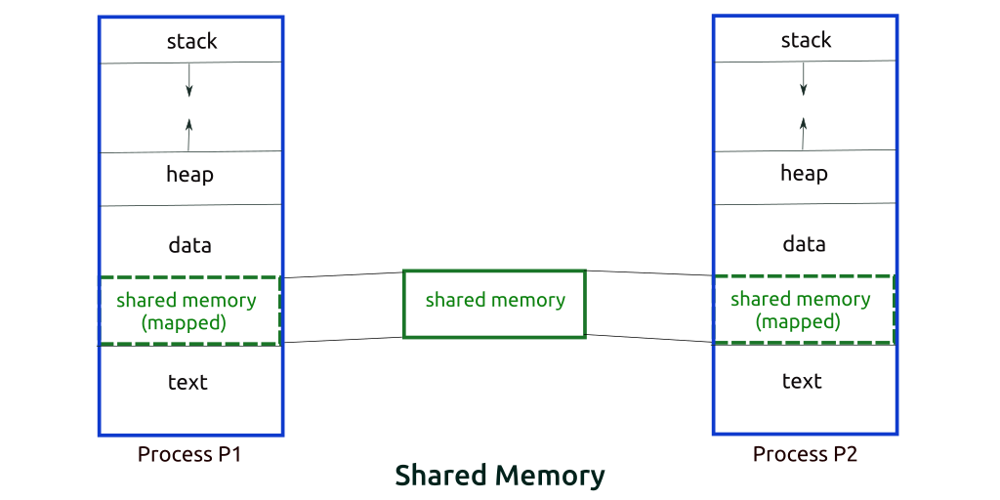

### [\*] IPC - Inter Process Communication

* How many number of ways are there for IPC in linux ?
  * 3 ways to perform IPC:  
 

    1. **Socket** : Be it TCP/UDP socket  or UNIX SOCKETS (PF\_UNIX)

    2. **Pipes** : Named Pipes 

      * These are uni-directional.
      * Pipes is always used with `fork()` syscall.    
      * After `fork()` , `dup2()` syscall is used to duplcate the parent file-descriptor to child's fd.
      * Example : `cat input.txt | ./sortNumbers ` 
 
    3. **Shared Memory or Message Queues**
      * Need to manage locks and mutex properly else it would be a disaster..

 

**Ques:** Which is the fastest way for IPC ?

**Ans:** Shared memory is the fastest way for IPC, but implementing them is harder as you would need to manage locks, mutex etc.
    * So , the performance output expected maybe less than the input as compared to sockets.
    * Also sockets are easily scalable.
