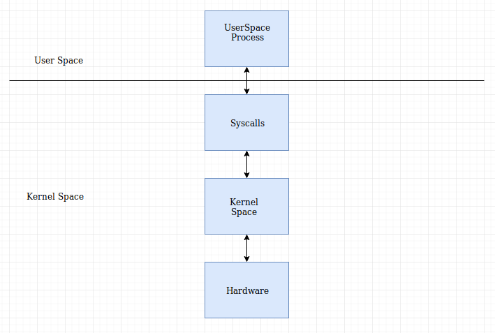

### [\*] Linux syscall

* **syscall** or **System Call** are the fundamental interface between an application and the linux kernel.

* It provides the medium to go from user-land to the kernel-land.

* These are generally not invoked directly (although you can in C and assembly code) , but rather via **wrapper functions** provide in **glibc**.
  * These wrapper functions act as normal functions like passing arguments , returning value etc.
  * Often(not always) the name of these functions and the name of the underlying syscall is same.

* What does a these wrapper function do ?
  * It performs the following things: 
    1. Setup information to identify the syscall and it's parameters.
    2. trigger the kernel switch mode.
    3. retrieve the result of syscall and set corresponding **errno** .

* syscalls though invoked using these wrapper functions are actually not simple functions , but instead are specific assembly instructions **(architeccture and kernel specific)**.

* Linux uses numbers to specify syscalls.

* When a syscall is made, and the transition from user-land to kernel-space occurs, the execution flow is interrupted and is transfered to kernel entry-point.

> **Note :** During the user-land to kernel-space transition the stack is also switched from user-stack to kernel-stack.

* What is system call Table ?
  * A system call table , is used by the dispatcher to map syscall numbers to kernel functions.

* A user-land program cannot directly access the kernel-space whereas

* **Context Switching** is inherently done when calling kernel-space routines via *ssycalls*.

#### [\*] vsyscall 
* vsyscall i.e Virtual syscall
  * It was added as a way to execute specific syscalls which do not need any real level of privilege to run.
  * This was done in order to reduce the syscall overhead i.e **Context Switching**.
  * Ex: gettimeofday() - it doesn't actually make syscall but rather vsyscall or vdso.

* **Limitations :**
  * The memory allocated is small and allows only 4 syscalls.
  * Security issue : The vssycall page is statically allocated to same address space in each process, which thus compromises the benefit of ASLR.
    * Although the security issue was resolved by trapping the instruction in kernel and then randomising, but it required additional syscall.

#### [\*] VDSO
* VDSO is the successor to **vsyscall**.
* VDSO i.e Virtual dynamic shared object 
  * It is a kernel mechanism for exporting a carefully selected **kernel-space** routines to **user-space** applications.
  * It is done so that the process can directly call these **kernel-space** routines without any extra performance penalty due to **Context Switch**.
* VDSO is a memory in user-space which exposes some kernel functionalities.

* It offers safety through memory randomisation i.e dynamic allocation.

* It can handle more than 4 syscalls.

* VDSO is linked via the standard glibc package.

> **Note :** 
> 1. In case the kernel doesn't has VDSO it will make traditional syscall.
> 2. vsyscall is slower as compared to VDSO as , in vsyscall a syscall is being made (for fixing the security issue) , whereas it's not in VDSO.

