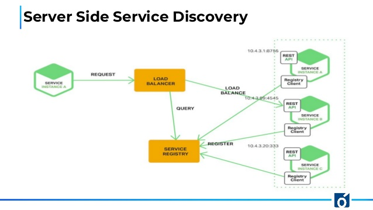

### [\*] Service Discovery in Cloud & IOT - ZeroConf

**Ques:** What is service-discovery (SD) ? 
**Ans:** 
 <a href="wikipedia.org">Service Discovery : </a>It is the automatic detection of devices and services offered by these devices on a computer network. 
  * A service discovery protocol is a network protocol that helps accomplish service discovery. 
  * It aims to reduce the configuration efforts from users. 
  * SD is like DNS 2.0(just analogy, not actually). 
 
 

**Ques:** Why Service Discovery is required in Cloud ? 
**Ans:**  When running a <a href="https://microservices.io/">*Micro-Service* based architecture</a> , each individual micro-service might need to communicate with other service in order to complete the entire request and since they might be assigned the IP addresses dynamically at not statically (as it would limit the auto-scaling functionality) , and thus they need the IP address to communicate , for which we need some sort of `auto-Service Discovery`.

  * Other Advantages :

    1. To provide load balancing and ease of horizontal scaling(dynamically add more machines in the distributed system), and their communications will be handled automatically.
    2. Dynamically add or remove machines, without any effect on the functionality of the system as a whole.

  * In the cloud environment , there are 2 potential ways to implement service-discovery :

    1. **DNS Based SD** :  Relies on the existing DNS systems for service discovery. (might be slower as compared to other)
       Example - Mesos DNS, spotify SRV records,

    2. **Key-value/sidecar datastore based SD** : Provides a central repository for service-discovery, a high performant key-value storage is used for storing the configuration, i.e Ip,port etc.
       Example - Eureka, consul etc.
 

**Ques:** How is Service Discovery performed in Cloud in the key-value datastore solution ? 
**Ans:**  There are 2 primary methods for Service discovery in Cloud : 

  * <a href="https://www.nginx.com/blog/service-discovery-in-a-microservices-architecture/">Service Discovery in Micro-service Asrchitecture</a>
  * In both the implementations, 
    * The service instance registers itself with a `service registry` at it's startup.
    * The service instance is removed from `service registry` once it terminates.
    * The service instance and the service registry uses a heartbeat mechanism for current status of the `service instance`.

  1. **Client Side Service Discovery** : The Client(not the end-user, but the some other service only) is responsible for finding out the network location of service instances and load-balance requests across them. 
    * Every service instance also contains a `register client`, using which it queries the `registry service`.
    * The client queries the registry service , and then uses some internal load-balancing algorithm and makes a request on any-one of the service instances.
    * It works with application specific load balancing and have lesser network hops (as not required to route through the load-balancer(LB))

      

  2. **Server Side Service Discovery** : The Client(not the end-user, but the some other service only)just queries the load-balancer(LB) directly , load-balancer(LB) handles the querying from registry service etc.
    * Therefore , simply 1 request to the ELB , it routes the rest  internally.
    * Lighter application code, as no need to implement the `register client`.
    * The entire `register client` mechanism instead of being in every service(which is a client too) is just implemented once in the LB.
    * But has a drawback, that it requires load-balancer and adds overhead of extra network hops.
   
  
   

  ---
  > **Note :** In the cloud environment , it's ensured that the `registry service` is always up and has zero downtime , whereas it cannot be ensured in an IOT network(atleast not everytime) , because ultimately in the IOT network the `registry service` will be running on a machine/device only and it might get down due to power issue or some-other issue.

  ---
 

**Ques:** Why Service Discovery is required in IOT ?
 
**Ans:**  When running an architecture like this in the IOT in a **STAR** topology
   
   
   
    Where all the communication from the IOT network to the Cloud is done via a gateway device, then in that case 
   
   
    * **What if that gateway device, gets down ?** in that case the **entire network will go down**   :-(
   
    * Therefore we have to ensure that irrespective of what may come, the **gateway device must never get down**, or if it gets down then some or the other device takes over it's responsibility, and thus when some other device has taken over it's responsibility there needs to be a mechanism for **Service Discovery** ,  so that all the devices can now connect to this new gateway node and the flow continues and network automatically gets back online.
 
 

**Ques:** Can we use the same mechanism that we used for the Cloud env, in IOT too ? 
**Ans:**  Unfortunaltely **No**.
  * Neither can we use the **DNS** method nor we can use the **KeyStore** based technique.
  * The reason for both is same i.e we will have to make sure that in whichever device these services will be running be it the dns-server or the keystore based service , those devices will have to be up and running perfectly fine always. 
  * This is a very big commitment to be made in the IOT network (where power drop could kill everything) and that too when you are installing your IOT controllers on a client's-site (and you have zero to None intervention , once installed)
 
 

**Ques:** So, how do we do it ? 
**Ans:**  <a href="https://www.ibm.com/support/knowledgecenter/en/SSB2MG_4.6.0/com.ibm.ips.doc/concepts/gx_gv_zero_configuration.htm">ZeroConf</a> i.e Zero configuration for the rescue.
   
  * **ZeroConf** is a methodology used in the printers,googlecast,macbooks etc, for finding the available machines in the network (over TCP/IP).
  * **ZeroConf** uses mDNS (multicast-DNS) to find, locate and connect to other machines on the network.
  * **ZeroConf** using mDNS allows the network to communicate with each other over domain names in the local namespace, and can be further extended to exterior of the network as well.
  * **Docker-swarm** also uses the avahi implementation for the orchestartion and management and service discovery in it's docker-network.
  * **Apple** uses bonjour services , Linux provides OSS version of bonjour names **avahi** for name resolution.
  * Most of the **embedded systems** board liek ESP8266, TI 3200CC etc provides direct support for name-resolution over mDNS.

  So instead of having a single machine where the **Service Registry** is stored , it is basically distributed in the entire network.
