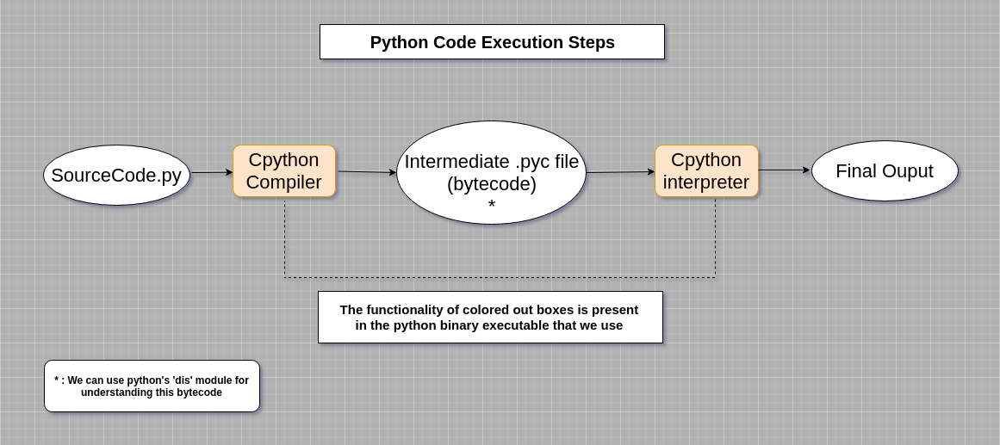
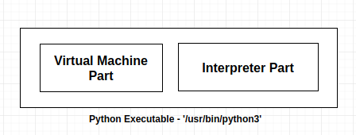
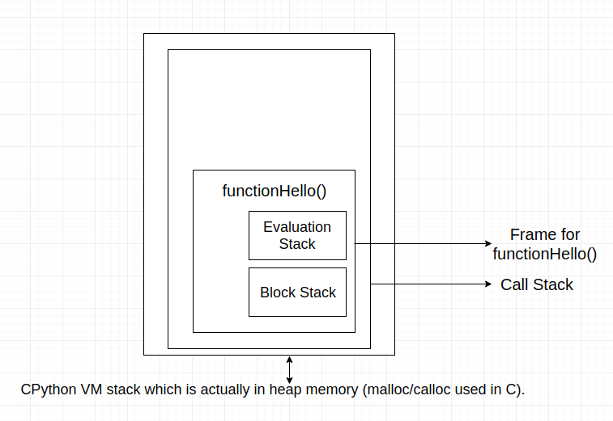

<h2>
HowDoesItWork ?
</h2>

-> Things mentioned here are specific to Cpython and may differ for different implementations of python. 
->  Every python object instance has a corresponding C-Type instance. 
-> <a id="heap">Python memory manager uses a <u><b><i>special heap</i></b></u> to keep all objects and data structures in memory.</a> 

<h3> * Python runs it's BYTECODE in a VIRTUAL MACHINE. </h3> 

  <b>  WTF ?</b> 

 &emsp; &emsp; <strong>Ques.1:</strong> Really <b> ByteCode </b>? isn't a compiled language like Java generates bytecode ? and iirc python is an interpreted language then why bytecode , what are you saying ?  
 &emsp; &emsp; <strong>Ques.2:</strong> What has a <b>Virtual Machine</b> got to do with python ?  

<b> Let me Explain....</b>  
 &nbsp &nbsp &nbsp &nbsp &nbsp <strong>Ans.1:</strong>    Yeah ByteCode , python actually first compiles the source code and generates the intermediatory bytecode (seen in a .pyc file) which is finally interpreted by the interpreter.

  
&emsp; &emsp; &emsp;  <strong>-> Need for ByteCode? </strong> 
&emsp; &emsp; &emsp; &emsp; &emsp;-> It improves the startup time i.e the speed with which they are loaded (<a href="https://docs.python.org/3/tutorial/modules.html#compiled-python-files">but has no affect on execution time</a>).
 
 
  &emsp; &emsp; &emsp; -> Python's <a href="#dis">'dis' (disassembler)</a> module can help in better understanding of python bytecode.
  
&emsp; &emsp; <strong>Ans.2:</strong> Here the word 'Virtual Machine' refers to a 'process based Virtual Machine' & not 'system based virtual machine' like (VMWare, Vbox etc). 
&emsp; &emsp; &emsp;-> <strong>But why VirtualMachine ? </strong>
 
&emsp; &emsp; &emsp; &emsp;  &emsp; * Platform Independency i.e write once and run anywhere , it also means that not only the '.py' file but also the compiled bytecode i.e '.pyc' on 1 platform can easily run on the same python version of another platform.
  
 &emsp; &emsp; &emsp; -> Python is a <a href="https://en.wikipedia.org/wiki/Stack_machine">stack based virtual machine</a> i.e both the interpreter part and the VM part is present in the <a href="#heap">heap</a>(special heap which contains everything.
 
&emsp; &emsp; &emsp; -> The Virtual Machine part is responsible for executing the bytecode.
  
 &emsp; &emsp; &emsp; &emsp; &emsp; &emsp; &emsp; 
 
&emsp; &emsp; &emsp; -> The CPython uses 3 different types of stack internally for it's bytecode execution.  
&emsp; &emsp; &emsp; &emsp;1. <b>Call Stack</b> : This stack primarily holds the control flow of the entire program , which also means that at entry of program this stack will always be empty. For every function call a 'frame' corresponding to that particular function is pushed in this stack and as soon as the function returns that 'frame' is popped off.
  
&emsp; &emsp; &emsp; &emsp;2. <b>Evaluation Stack</b> : In each frame, there's an evaluation stack (also called the data stack). This stack is where execution of that function occurs, and executing Python code consists mostly of pushing things onto this stack, manipulating them, and popping them back off.
  
&emsp; &emsp; &emsp; &emsp;3. <b>Block Stack</b>
Also in each frame, there's a block stack. This is used by Python to keep track of certain types of control structures: loops, try/except blocks, and with blocks all cause entries to be pushed onto the block stack, and the block stack gets popped whenever you exit one of those structures. This helps Python know which blocks are active at any given moment so that, for example, a continue or break statement can affect the correct block.
 
&emsp; &emsp; &emsp; 
 
<h4 id="dis"> Dis - disassembler </h4>
      LOAD_FAST : Places an object on TOS(top of stack)

